# AI Instructor Agent

PPT 파일을 입력하면 슬라이드 분석, 강의 스크립트 생성, 음성 변환, 자막/하이라이트 합성, 최종 강의 영상 제작, 복습 퀴즈 생성까지 자동화하는 멀티노드 AI Agent 프로젝트입니다.

## Project Overview

교육 콘텐츠 제작은 강사가 슬라이드를 읽고, 설명 대본을 작성하고, 녹음하고, 영상 편집까지 수행해야 하므로 반복 비용이 큽니다. 이 프로젝트는 PPT 기반 강의 영상 제작 과정을 LangGraph 기반 Agent 파이프라인으로 묶어, 사용자가 PPT와 강의 톤을 입력하면 강의 자료를 자동 생성하도록 설계했습니다.

## Key Features

- PPT 슬라이드의 텍스트, 표, 이미지, 스냅샷 추출
- 슬라이드 제목 기반 Tavily 웹 검색으로 최신 부연 정보 수집
- GPT-4o-mini 기반 슬라이드 요약 및 60~90초 구어체 강의 스크립트 생성
- 사용자 피드백 기반 강의 스크립트 수정
- GPT-4o-mini-TTS 기반 음성 파일 생성
- FFmpeg를 활용한 슬라이드 이미지 + 음성 + 자막 + 핵심 키워드 하이라이트 영상 합성
- Chroma Vector DB 기반 맥락형 객관식 복습 퀴즈 생성
- Gradio 웹 UI를 통한 PPT 업로드, 톤/음성 선택, 영상 미리보기, 다운로드, 퀴즈 풀이 제공

## Architecture

```mermaid
flowchart LR
    A[PPT Upload] --> B[Parse Slides]
    B --> C[Build Vector DB]
    C --> D[Search Context]
    D --> E[Generate Page Summary]
    E --> F[Generate Script]
    F --> G[Apply Feedback]
    G --> H[Generate Subtitles]
    H --> I[Extract Highlight Keywords]
    I --> J[TTS]
    J --> K[Make Slide Video]
    K --> L[Burn Subtitles]
    L --> M{More Slides?}
    M -- Yes --> D
    M -- No --> N[Generate Quiz]
    N --> O[Concat Videos]
    O --> P[Final Lecture MP4]
```



## Repository Structure

```text
.
├── notebooks/
│   └── ai_instructor_agent.ipynb
├── presentation/
│   └── ai_instructor_agent_presentation.pptx
├── docs/
│   ├── agent-workflow.md
│   ├── project-summary.md
│   └── security-note.md
├── src/
│   └── pipeline_nodes.md
├── .env.example
├── .gitignore
├── requirements.txt
└── README.md
```

## Tech Stack

- Python
- LangGraph, LangChain
- OpenAI GPT-4o-mini, GPT-4o-mini-TTS
- Tavily Search
- ChromaDB, OpenAI Embeddings
- python-pptx, Pillow
- FFmpeg, LibreOffice
- Gradio

## Main Agent Nodes

| Node | Role |
| --- | --- |
| `node_parse_all` | PPT 슬라이드 텍스트, 표, 이미지, 스냅샷 추출 |
| `node_build_vector_db` | 슬라이드 내용을 임베딩하여 Chroma Vector DB 구축 |
| `node_tool_search` | 슬라이드 제목 기반 외부 검색 정보 수집 |
| `node_generate_page` | 멀티모달 입력 기반 슬라이드 설명문 생성 |
| `node_generate_script_ctx` | 전체 맥락을 반영한 강의 스크립트 생성 |
| `node_retouch_script` | 사용자 피드백 기반 스크립트 수정 |
| `node_gen_subtitle` | 문장 단위 자막 데이터 생성 |
| `node_highlight_keywords` | 핵심 키워드 추출 및 화면 강조 정보 생성 |
| `node_tts` | 강의 스크립트를 음성으로 변환 |
| `node_make_video` | 슬라이드 이미지와 음성을 합성해 개별 영상 생성 |
| `node_burn_subtitle` | FFmpeg로 자막을 영상에 합성 |
| `node_generate_quiz` | Vector DB 기반 복습 퀴즈 생성 |
| `node_concat_videos` | 슬라이드별 영상을 최종 강의 영상으로 병합 |

## Results

최종 결과물은 PPT 하나를 기반으로 생성되는 강의 영상 MP4와 복습 퀴즈입니다. 발표 자료 기준으로 사용자 피드백 반영, 자동 자막, 핵심 키워드 하이라이트, 맥락 기반 퀴즈 생성 기능까지 고도화했습니다.

## How To Run

이 노트북은 Google Colab 환경을 기준으로 작성되었습니다. 실행 전 `.env.example`을 참고해 API Key를 준비하고, Colab 또는 로컬 환경에 필요한 시스템 패키지인 LibreOffice, FFmpeg, 한국어 폰트를 설치해야 합니다.

```bash
pip install -r requirements.txt
```

필요한 환경 변수:

```bash
OPENAI_API_KEY=your_openai_api_key
TAVILY_API_KEY=your_tavily_api_key
```

## Security

공개 저장소 업로드 전 노트북 출력값은 제거했고, API Key 확인 셀은 실제 키를 출력하지 않도록 수정했습니다. 자세한 내용은 [security-note.md](docs/security-note.md)를 참고하세요.
